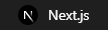

I’m a self-taught fullstack developer with a strong focus on frontend development.
I’m driven by a commitment to continuous learning and personal growth, always eager to expand my knowledge.

---

### 🛠️ Technologies & Tools

|  |  |  |  |  |  |
| :----------------------------------------------------------: | :----------------------------------------------------------: | :------------------------------------------------: | :------------------------------------------------: | :------------------------------------------------: | :----------------------------------------------------------: |
|  |  |  |  |  |  |
|  |  |  |  |
---